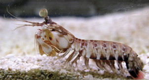
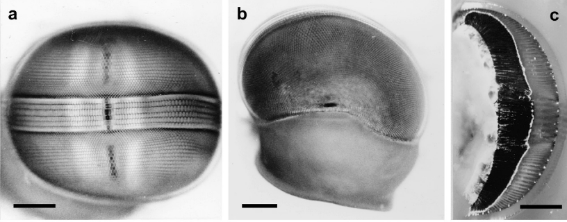
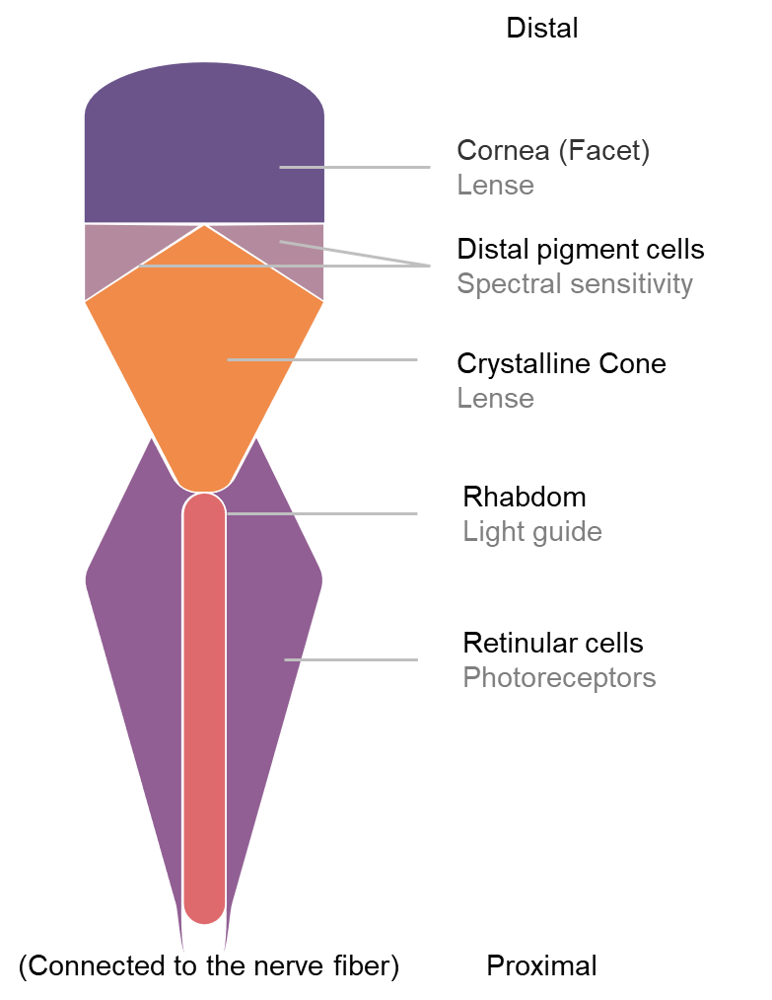

# Notes on Stomatopod's visual ability: 1

## Research subject

The research subject is the Stomatopod, which is commonly known as the mantis shrimp.

The Stomatopods have the greatest diversity of color receptor types known for any animal, and have a diverse set of photoreceptors that visualize polarized light. The review will focus on the features of the Stomatopod's ability to visualize color and polarized light .

In this field, the term "Stomatopod" is usually restricted to Gonodactyloidea and Lysiosquilloidea species.

*Odontodactylus scyllarus*, a gonodactyloid stomatopod, is a commonly used model organism.

*Odontodactylus havanensis*, (Cronin, 2006) *Copyright © 2006 Elsevier Ltd. All rights reserved.*, License Number 5716910107274

## Morphological description of the compound eye of Stomatopods

The apposition compound eyes of an *Odontodactylus scyllarus* is morphologically divided in to three parts, namely (a) the dorsal hemisphere, (b) the **midband**, and (c) the ventral hemisphere. The basic units of vision of the compound eye is termed as "**ommatidia**".

The midband has 6 rows of ommatidia with bigger cornea compared with other ommatidia. This suggest that the midband and hemispherical ommatidia have different function. The dorsal hemisphere and a ventral hemisphere is spatially divided up by the midband.(Marshall, 1988)

(The compond eye of *Lysiosquilla tredecimdentata* has larger dorsal and ventral hemispheres, but still has the midband consisting of 6 rows of ommatidia. The compond eye of Oratosquilla solicitans\*, from another superfamily, only has 2 midbands.) (Marshall et al., 2007)

Eye of *Odontodactylus scyllarus*, (a) Frontal view, Scale 500 mm. (b) Dorsal view, showing the dorsal hemisphere and eye stalk. Scale 500 mm. (c) Sagittal section through *O. scyllarus* eye. From right to left: cornea, crystalline cones, distal retinal pigment (white line), retina (black crescent), and the first optic neuropil, the lamina ganglionaris (white region). Scale 400 mm. (Marshall et al., 2007) *Copyright © 1988, Springer Nature Limited*

## General anatomical description of the ommatidia of Stomatopods

The 6 rows of the midband ommatidia are structurally different from one another. There are 16 anatomically different photoreceptors in the compond eye of Stomatopod.

A ommatidium, from the distal end to the proximal end, roughly consists of 4 main parts, namely (a) cornea(lenses), (b) crystalline cones, (c) distal pigment, (d) rhabdom and sensory cells. At the proximal end, the ommatidia are connected to the nerve fiber by axons. (Marshall, 1988)

## References

Cronin, T. W. (2006). Stomatopods. *Current Biology*, *16*(7), R235-R236. <https://doi.org/10.1016/j.cub.2006.03.014>

Marshall, J., Cronin, T. W., & Kleinlogel, S. (2007). Stomatopod eye structure and function: a review. *Arthropod Struct Dev*, *36*(4), 420-448. <https://doi.org/10.1016/j.asd.2007.01.006>

Marshall, N. J. (1988). A Unique Color and Polarization Vision System in Mantis Shrimps. *Nature*, *333*(6173), 557-560. <https://doi.org/DOI> 10.1038/333557a0
