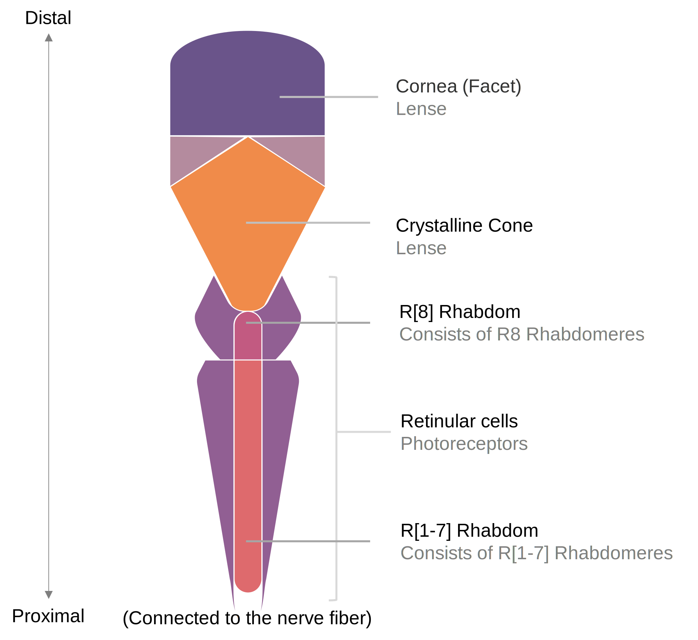
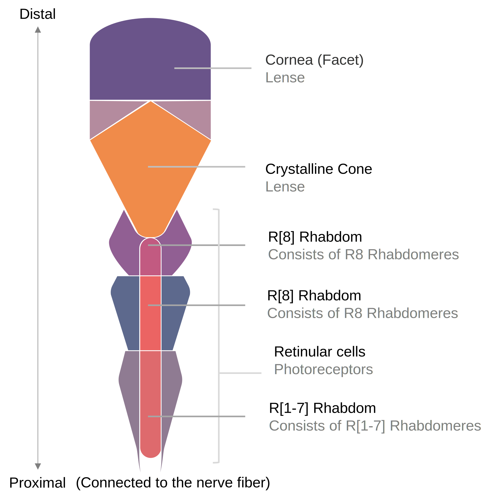
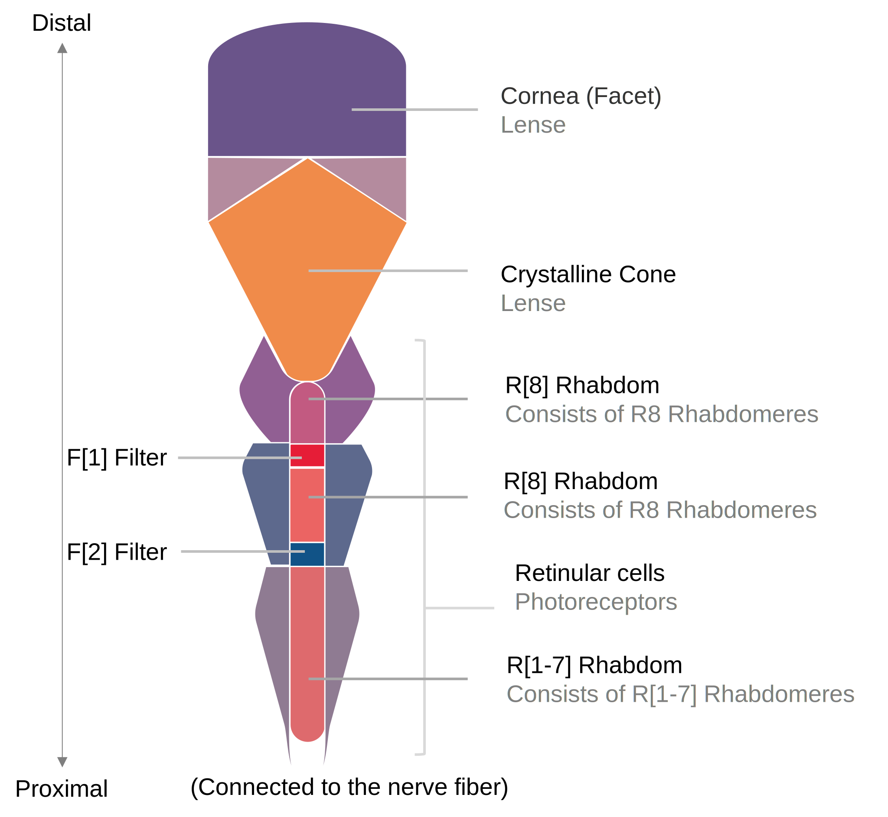

# Notes on Stomatopod's visual ability: 2

## Terms and abbreviations

| Abbreviation | Term                                    | Description                                                  | Notes                                                        |
| ------------ | --------------------------------------- | ------------------------------------------------------------ | ------------------------------------------------------------ |
| MO[x]        | mid-band ommatidia(中带复眼)            | Basic units of a mid-band.                                   | There are 6 **rows** of midband eyes, designated as MO[1-6]. Each ommatidium in MO[1-4] has 3 tiers of rhabdom. Each ommatidium in MO[5,6] has 2 tiers of rhabdom. A  hemispherical ommatidium has 2 tiers of rhabdom. |
| R[x]         | Rhabdomeres(感杆）                      | The elongated rod-like portion of the retinular cells, the subunit of the  rhabdom, containing closely spaced and longitudinal rows of microvilli and  pigment granules. | There are 8 **types** of rhabdomeres, designated as R[1-8]. R8  cells consist the most distal tier of rhabdom in all types (midband and  hemispherical) of ommatidium. |
| DR[x]        | Distally placed rhabdomeres（远端感杆） | Rhabdomeres that consist the distally placed rhabdom in **MO[1-4]**, which is  placed between the R[8] rhabdom and the PR rhabdom. | There are 7 **types** of DR, which are  R[1-7]. They are specially designated as DR[1-7]. |
| PR[x]        | Proximal placed rhabdomeres（近端感杆） | Rhabdomeres that consist the proximally placed rhabdom in **MO[1-4]**, which  is placed at the proximal end, that is, close to the basement menbrane. | There are 7 **types** of PR,  which are R[1-7]. They are specially  designated as PR[1-7]. |
| F[x]         | Filter（滤光体）                        | Specialized, coloured intra-rhabdomal structures in **MO[2,3]**, function as  the filter of light in a specific wavelength band. | There are 2 **layers** of filters, designated as F[1], F[2]. F[1] is relatively distal and F[2] is relatively proximal. |

## General structures of hemispherical ommatidia

## General structures of  mid-band ommatidia

### General Structure of MO[1-4]

### Special structures of MO[2,3] - Filters

### General Structure of MO[5,6]

The General structure of MO[5,6] is similar to that of hemispherical ommatidia. However, the arrangement of microvillar in MO[5,6] are modified.

- Very thin layering with precise orthogonal arrangements in R[1-7];
- Unidirectionally arranged microvili in R[8];
- Elongated R[8] rhabdomere;
- A secondary orthogonality of the microvilli between MO[5,6].
